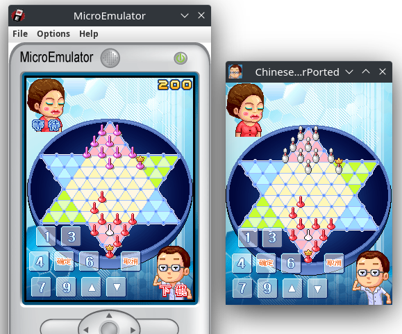

# 中国跳棋游戏 桌面移植版

### 简介
《中国跳棋》最初是三星手机上的内置游戏，故事模式共有6关，主人公需要战胜所有人，最后和国王决战，最终实现自己的愿望。

此游戏在二十年前由韩国的mobilebus公司开发，基于[J2ME平台](https://www.oracle.com/java/technologies/javameoverview.html)（Java 2, Micro Edition，现已过时），运行在按键手机和部分早期触屏手机上。本项目基于此游戏的旧代码，将它移植到了现代桌面平台，使用libGDX游戏开发框架，支持运行在Windows, MacOS, Linux操作系统，后续可能支持Android和iOS平台。



左为原版（使用[microemulator](https://github.com/barteo/microemu)运行）,右为移植版本。


### 如何游玩
运行此游戏需要Java17及以上版本，在[这里](https://github.com/creeper12356/ChineseCheckerPorted/releases/latest)下载最新的jar包运行：
```sh
java -jar ./ChineseCheckerPorted-x.x.x.jar 
```

### 开发进度
本项目目前只实现了故事模式的核心部分，还有很多细节有待完善，包括但不限于：
- 故事模式的剧情动画
- 对战模式
- 分数统计和计算
- 游戏音效播放
- 各个菜单页面及跳转
- ...

### 致谢
- 游戏开发框架： [libGDX](https://libgdx.com/)
- 原版游戏开发公司： [support@mobilebus.co.kr](support@mobilebus.co.kr)
- 原版游戏来源： [DOSPY论坛](https://www.dospy.wang/thread-9224-1-1.html)
- 反编译工具： [CFR](https://github.com/leibnitz27/cfr)
- 代码理解助手： [Github Copilot](https://github.com/features/copilot)
- J2ME模拟器： [microemulator](https://github.com/barteo/microemu)
